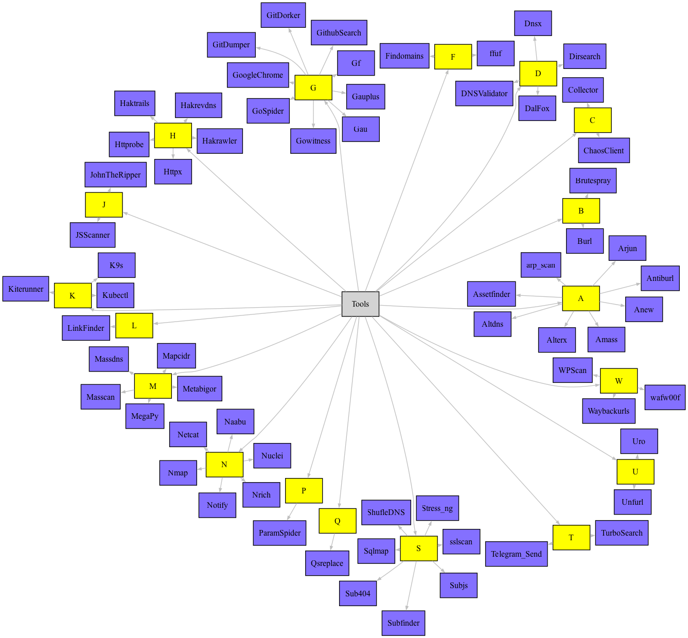

# HackerWhale


Este projeto é o resultado da necessidade encontrada durante um trabalho onde haviam poucos recursos disponíveis, e uma imagem de container personalizada foi a solução criada. 

Assim foi criado o "[HackerWhale](https://github.com/0xtiago/HackerWhale)", que em poucos minutos te disponibilizará tudo o que é necessário para realizar testes em sua rede, seja em redes corporativas ou ambiente Kubernetes.

**Docker**

```
docker pull 0xtiago/hackerwhale:latest
```

**Kubernetes**

```bash
kubectl apply -f hackerwhale-k8s.yaml
```

Para casos de uso e detalhes, basta seguir neste humilde artigo: https://tiagotavares.io/blog/hackerwhale_container/. 

